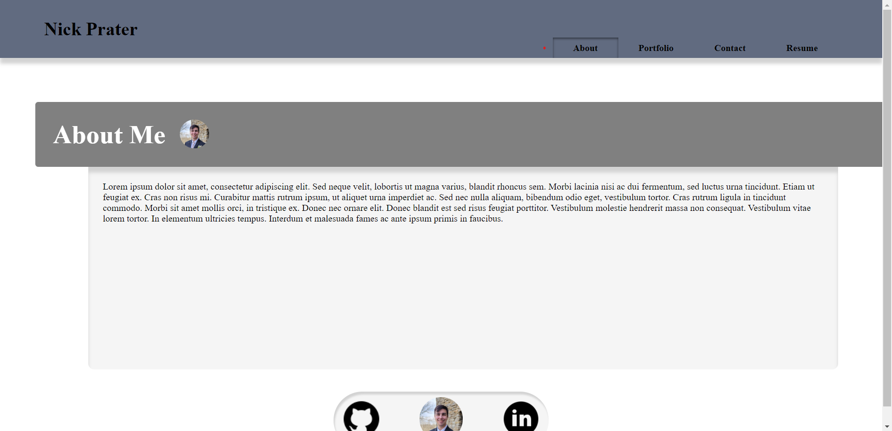

# developer-portfolio

This is my developer portfolio; it has four sections: an about me page, which contains information about me; a portfolio page, which contains images that link to some of my work; a contact page, which allows a visitor to contact me via email from the website, and a resume page, which features my resume. The information is currently a placeholder, but it will be populated with real information about me soon.

This wep-app uses React and was created from the ground up by me without the use of a framework like bootstrap. The application is deployed to github pages, and it can be found [here](https://nikpratr.github.io/developer-portfolio/#about). The main repository can be found [here](https://github.com/NikPratr/developer-portfolio).

